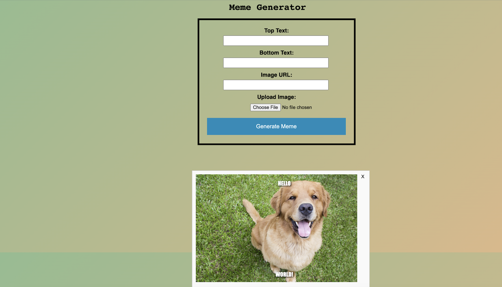

<!-- PROJECT LOGO -->
 

  
  <h3 align="center">MEME GENERATOR</h3>

  

    A Very Easy to Use App That Allows Users to Create and Design Memes In Every Way Possible. The Best Part of The Meme Generator is There Are No Water Marks or Labels Attached! 
     
    <a href="https://memes.hasanabdulla.repl.co/"><strong>HOME PAGE</strong></a>
  

<!-- TABLE OF CONTENTS -->

  
Table of Contents

  <ol>
    <li>
      <a href="#about-the-project">About The Project</a>
    </li>
    <li><a href="#contact">Contact</a></li>
  </ol>

<!-- ABOUT THE PROJECT -->
## About The Project

The Meme Generator Is An Application That Was Designed For Users Who Want to Create Funny Memes For Their Personal Websites, Social Media Accounts, and More!

<!-- CONTACT -->
## Contact

Your Name - [Hasan Abdulla](https://www.linkedin.com/in/hasan-abdulla1903/) - ishabdulla26@gmail.com

Project Link: [https://github.com/hAbdulla19/MEME-GENERATOR](https://github.com/hAbdulla19/MEME-GENERATOR)
